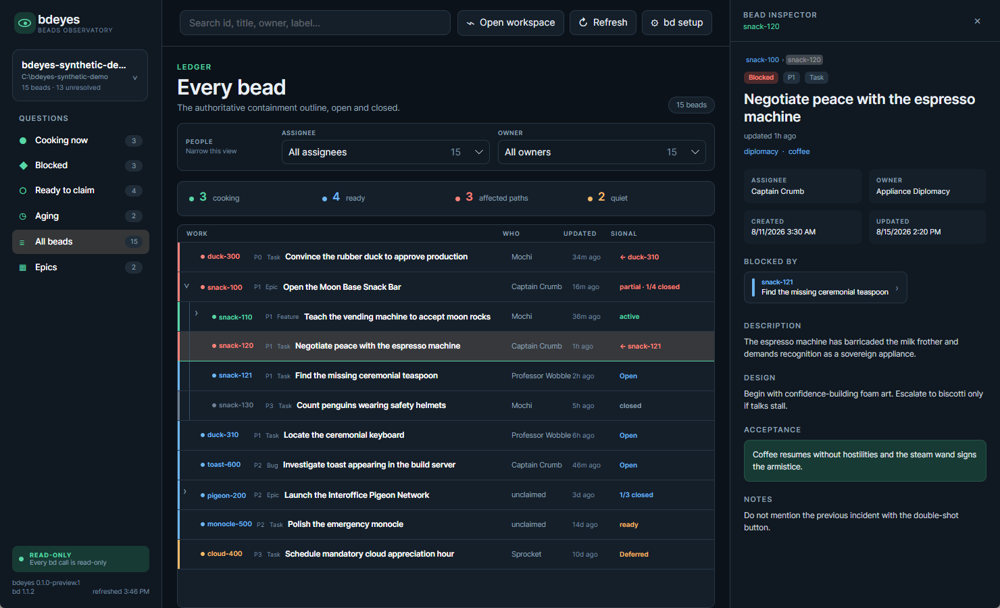
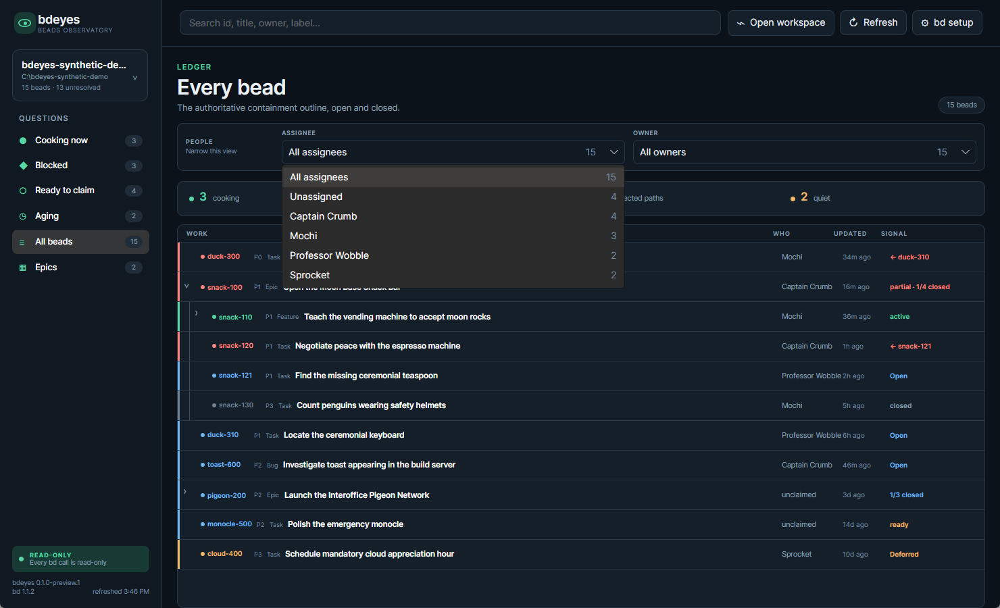

# bdeyes

A read-only desktop observatory for [Beads](https://github.com/gastownhall/beads). bdeyes turns a ledger into a compact operational outline: what is moving, what is blocked, what is ready, what has gone quiet, and who owns it.

## Screenshots

These screenshots come from a generated demo fixture. Every bead ID, title, person, owner, timestamp, comment, and path is fictional; no live ledger data appears.



*The containment outline and inspector, with the espresso machine awaiting a ceremonial teaspoon.*



*Assignee and owner facets compose with the current operational view; unassigned work remains explicit.*

## Preview status

bdeyes is currently a `0.1.0-preview.1` project.

- Windows 10 and 11 are the supported preview binary target.
- Windows behavior is exercised against a live Beads workspace with native UI Automation.
- Windows, macOS, and Linux compile and run behavioral tests in CI.
- macOS and Linux binaries are not published until each desktop surface has a native smoke test and packaging contract.

The application is intentionally read-only. It is an observability client, not a second task editor.

## What it shows

- Active, blocked, ready, aging, all-bead, and epic views.
- A virtualized hierarchy built from authoritative Beads parent relationships.
- Ancestor-preserving search and operational filters.
- Assignee and owner filters, including explicit unassigned work.
- Dependency, progress, activity, comment, and containment details.
- Keyboard expansion and accessible Tree/TreeItem semantics.
- Automatic one-minute refresh while preserving valid view state.

## Requirements

- A Beads workspace.
- `bd` installed and configured for that workspace.
- Preview compatibility is verified with `bd 1.1.2`. Later versions may work, but their JSON contract has not yet been certified.

A self-contained release does not require the .NET runtime. Building from source requires the .NET 10 SDK.

## Install and run on Windows

1. Install and configure [`bd`](https://github.com/gastownhall/beads).
2. Download the `win-x64` archive from the bdeyes GitHub release.
3. Extract the complete archive and run `Bdeyes.exe`.
4. Choose a repository containing an active Beads workspace.

Windows may warn about an unsigned preview binary. Before running it, compare the archive hash with the `.sha256` file attached to the same release:

```powershell
Get-FileHash -Algorithm SHA256 .\bdeyes-0.1.0-preview.1-win-x64.zip
```

You can open a workspace directly from the extracted archive:

```powershell
.\Bdeyes.exe --workspace C:\path\to\workspace
```

## Finding `bd`

bdeyes resolves the CLI in this order:

1. A path explicitly saved in **bd setup**.
2. `BDEYES_BD`.
3. The process `PATH`.
4. Conservative platform install locations.

Open **bd setup** to inspect the selected executable and version, browse to another executable, test it without opening a workspace, save it, or return to automatic discovery.

bdeyes stores only the optional executable path. It does not read or store a ledger password, server credential, or Beads credential file. Authentication remains owned by `bd` and its protected credential store.

## Read-only boundary

Every ledger command enters global `bd --readonly` mode. bdeyes:

- invokes the installed `bd` CLI;
- consumes JSON emitted by `bd`;
- never reads Dolt tables directly;
- never imports `.beads/issues.jsonl`; and
- exposes no mutation command.

Read-only does not mean non-sensitive. Issue titles, descriptions, comments, ownership, and dependency data are rendered on screen. Protect screenshots and desktop access according to the sensitivity of the workspace.

## Local settings

bdeyes stores local UI state under the operating system's local application-data directory in `bdeyes/settings.json`. The file contains only:

- the last workspace path;
- expanded issue IDs; and
- an optional `bd` executable path.

Deleting this file resets local bdeyes state. It does not modify the Beads workspace.

## Build and test

```sh
dotnet restore Bdeyes.slnx
dotnet build Bdeyes.slnx --configuration Release --no-restore
dotnet test Bdeyes.slnx --configuration Release --no-build
```

Run from source:

```sh
dotnet run --project src/Bdeyes/Bdeyes.csproj -- --workspace /path/to/workspace
```

Create the self-contained Windows preview archive and checksum:

```powershell
powershell -NoProfile -File scripts/package-windows.ps1
```

Contributions should preserve the CLI-only read boundary and include behavioral coverage for any changed user-facing contract.

## Reporting problems

Use [GitHub Issues](https://github.com/murdarch/bdeyes/issues) for reproducible, non-sensitive bugs and feature requests. For security-sensitive reports, follow [SECURITY.md](SECURITY.md). Never include ledger passwords, credential files, private keys, or confidential bead content in a report.

## License

bdeyes is available under the [MIT License](LICENSE). Use it, modify it, and redistribute it under those terms.
